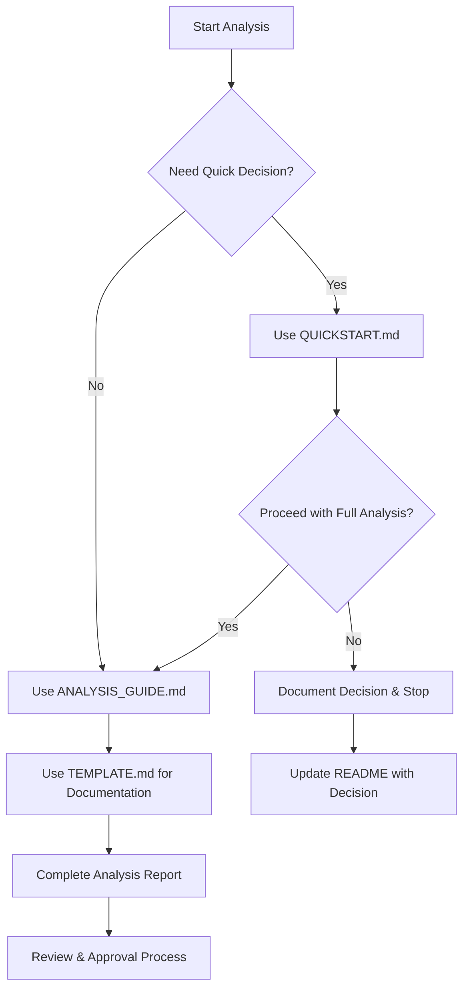

# Knowledge Pipeline Analysis Documentation

**Purpose**: Comprehensive analysis framework for evaluating Agent Zero's knowledge/document ingestion pipeline and determining if Graphiti integration is needed.

---

## 📚 Documentation Overview

This analysis framework consists of four complementary documents designed to guide developers through a systematic evaluation of Agent Zero's knowledge system:

### **1. KNOWLEDGE_PIPELINE_ANALYSIS_GUIDE.md** 
**📖 The Complete Analysis Guide**
- **Purpose**: Comprehensive step-by-step analysis methodology
- **Time Required**: 4-6 hours for complete analysis
- **Use When**: Conducting thorough knowledge system evaluation
- **Audience**: Senior developers, architects, technical leads

### **2. KNOWLEDGE_ANALYSIS_QUICKSTART.md**
**⚡ Quick Assessment Checklist**  
- **Purpose**: Rapid initial assessment and decision framework
- **Time Required**: 30 minutes for quick evaluation
- **Use When**: Need fast go/no-go decision on full analysis
- **Audience**: Any developer familiar with Agent Zero

### **3. KNOWLEDGE_ANALYSIS_TEMPLATE.md**
**📝 Analysis Report Template**
- **Purpose**: Structured template for documenting analysis results
- **Time Required**: Used throughout analysis process
- **Use When**: Creating formal analysis documentation
- **Audience**: Developer conducting the analysis

### **4. KNOWLEDGE_ANALYSIS_README.md** 
**📋 This Overview Document**
- **Purpose**: Guide to using the analysis framework
- **Time Required**: 5 minutes to understand framework
- **Use When**: Starting knowledge pipeline analysis
- **Audience**: Anyone involved in the analysis process

---

## 🚀 Getting Started

### **Step 1: Determine Analysis Scope**

**Quick Assessment (30 minutes)**:
```bash
# Start here for rapid evaluation
open refactoring_plan/KNOWLEDGE_ANALYSIS_QUICKSTART.md
```

**Full Analysis (4-6 hours)**:
```bash
# Use for comprehensive evaluation
open refactoring_plan/KNOWLEDGE_PIPELINE_ANALYSIS_GUIDE.md
```

### **Step 2: Check Prerequisites**

**Before starting any analysis, ensure you have:**
- [ ] Access to Agent Zero codebase
- [ ] Understanding of current memory system (see `MEMORY_HISTORY_INTERACTIONS.md`)
- [ ] Familiarity with Graphiti capabilities (see `API_REFERENCE.md`)
- [ ] Knowledge of RAG systems and vector databases
- [ ] Time allocated for analysis (30 minutes to 6 hours depending on scope)

### **Step 3: Choose Your Path**



---

## 📋 Analysis Decision Framework

### **Use Quick Assessment When:**
- ✅ Need rapid go/no-go decision
- ✅ Limited time available (< 1 hour)
- ✅ Initial feasibility check required
- ✅ Stakeholders need quick estimate
- ✅ Determining if full analysis is warranted

### **Use Full Analysis When:**
- ✅ Comprehensive evaluation required
- ✅ Implementation planning needed
- ✅ Architecture decisions must be made
- ✅ Detailed documentation required
- ✅ Multiple stakeholders involved
- ✅ Integration complexity is high

### **Skip Analysis When:**
- ✅ Recent comprehensive analysis exists
- ✅ Knowledge integration already documented
- ✅ Current system meets all requirements
- ✅ No business need for knowledge features
- ✅ Other priorities take precedence

---

## 🎯 Expected Outcomes

### **Quick Assessment Outcomes:**
- **Go/No-Go Decision**: Clear recommendation on whether to proceed
- **Effort Estimate**: Rough estimate of full analysis time
- **Priority Assessment**: Understanding of integration urgency
- **Resource Planning**: Knowledge of skills/time needed

### **Full Analysis Outcomes:**
- **Comprehensive Documentation**: Complete analysis report
- **Implementation Plan**: Detailed roadmap with timelines
- **Architecture Design**: Integration architecture and data flows
- **Risk Assessment**: Identified risks and mitigation strategies
- **Business Case**: ROI analysis and benefit quantification

---

## 📊 Quality Assurance

### **Analysis Quality Checklist:**
- [ ] **Completeness**: All required sections documented
- [ ] **Accuracy**: Code references verified against actual codebase
- [ ] **Feasibility**: Technical approach is realistic and implementable
- [ ] **Clarity**: Documentation is clear and actionable
- [ ] **Validation**: Findings reviewed by appropriate stakeholders

### **Review Process:**
1. **Self-Review**: Analyst validates own work
2. **Peer Review**: Another developer reviews technical accuracy
3. **Architecture Review**: Senior architect reviews design decisions
4. **Stakeholder Review**: Business stakeholders review recommendations

---

## 🔄 Integration with Existing Refactoring

### **Relationship to Memory System Refactoring:**
The knowledge pipeline analysis should consider the existing memory system refactoring:

- **Check Dependencies**: How does knowledge integration affect memory refactoring?
- **Avoid Conflicts**: Ensure knowledge changes don't break memory integration
- **Leverage Synergies**: Look for opportunities to share infrastructure
- **Coordinate Timelines**: Align knowledge and memory integration schedules

### **Required Cross-References:**
- [ ] Review `MEMORY_HISTORY_INTERACTIONS.md` for memory system details
- [ ] Check `ARCHITECTURE.md` for overall system architecture
- [ ] Validate against `API_REFERENCE.md` for API consistency
- [ ] Coordinate with `IMPLEMENTATION_GUIDE.md` for integration approach

---

## 📁 File Organization

### **Analysis Working Directory:**
```
refactoring_plan/
├── KNOWLEDGE_ANALYSIS_README.md          # This overview (start here)
├── KNOWLEDGE_ANALYSIS_QUICKSTART.md      # 30-minute quick assessment
├── KNOWLEDGE_PIPELINE_ANALYSIS_GUIDE.md  # Complete analysis guide
├── KNOWLEDGE_ANALYSIS_TEMPLATE.md        # Report template
├── [Generated Analysis Reports]           # Your analysis outputs
│   ├── KNOWLEDGE_ANALYSIS_REPORT_[DATE].md
│   ├── KNOWLEDGE_INTEGRATION_PLAN.md
│   └── KNOWLEDGE_ARCHITECTURE_DESIGN.md
└── [Existing Refactoring Docs]           # Reference materials
    ├── MEMORY_HISTORY_INTERACTIONS.md
    ├── ARCHITECTURE.md
    ├── API_REFERENCE.md
    └── IMPLEMENTATION_GUIDE.md
```

### **Naming Conventions:**
- **Analysis Reports**: `KNOWLEDGE_ANALYSIS_REPORT_YYYY-MM-DD.md`
- **Integration Plans**: `KNOWLEDGE_INTEGRATION_PLAN.md`
- **Architecture Docs**: `KNOWLEDGE_ARCHITECTURE_DESIGN.md`
- **Implementation Guides**: `KNOWLEDGE_IMPLEMENTATION_GUIDE.md`

---

## 🚨 Common Pitfalls to Avoid

### **Analysis Pitfalls:**
- ❌ **Skipping existing documentation review** - Always check if work already exists
- ❌ **Analyzing in isolation** - Consider impact on memory system refactoring
- ❌ **Over-engineering solutions** - Focus on actual requirements, not theoretical benefits
- ❌ **Ignoring performance implications** - Consider scalability and resource usage
- ❌ **Inadequate stakeholder input** - Get requirements from actual users

### **Documentation Pitfalls:**
- ❌ **Incomplete analysis** - Missing key components or use cases
- ❌ **Inaccurate code references** - Not validating against actual codebase
- ❌ **Unrealistic timelines** - Underestimating implementation complexity
- ❌ **Poor risk assessment** - Not identifying potential integration challenges
- ❌ **Lack of alternatives** - Not considering multiple implementation approaches

---

## 📞 Support and Escalation

### **When to Seek Help:**
- **Technical Complexity**: Integration requires architectural changes
- **Resource Constraints**: Analysis reveals significant implementation effort
- **Conflicting Requirements**: Knowledge and memory integration conflicts
- **Performance Concerns**: Integration may impact system performance
- **Business Alignment**: Unclear business value or requirements

### **Escalation Path:**
1. **Technical Questions**: Senior developer or tech lead
2. **Architecture Decisions**: System architect or engineering manager
3. **Resource Planning**: Project manager or engineering manager
4. **Business Decisions**: Product owner or business stakeholder
5. **Strategic Decisions**: CTO or executive team

---

## ✅ Success Criteria

### **Analysis is Successful When:**
- ✅ Clear recommendation made (proceed/skip/investigate further)
- ✅ Technical feasibility thoroughly evaluated
- ✅ Implementation effort accurately estimated
- ✅ Business value clearly articulated
- ✅ Risks identified and mitigation planned
- ✅ Stakeholder alignment achieved
- ✅ Documentation complete and actionable

### **Next Steps After Analysis:**
- **If Proceeding**: Begin implementation planning and resource allocation
- **If Skipping**: Document decision rationale and set review timeline
- **If More Investigation Needed**: Define specific research areas and timeline

---

## 📈 Continuous Improvement

### **Feedback Collection:**
After completing analysis, please provide feedback on:
- **Framework Effectiveness**: Did the guides provide adequate structure?
- **Time Estimates**: Were time estimates accurate?
- **Missing Elements**: What additional guidance would be helpful?
- **Process Improvements**: How could the analysis process be improved?

### **Framework Updates:**
This analysis framework will be updated based on:
- User feedback and lessons learned
- Changes to Agent Zero architecture
- Evolution of Graphiti capabilities
- New integration patterns and best practices

---

**Last Updated**: [Current Date]  
**Framework Version**: 1.0  
**Maintainer**: [Team/Individual responsible for updates]
