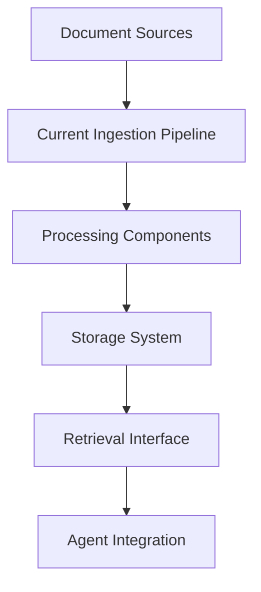
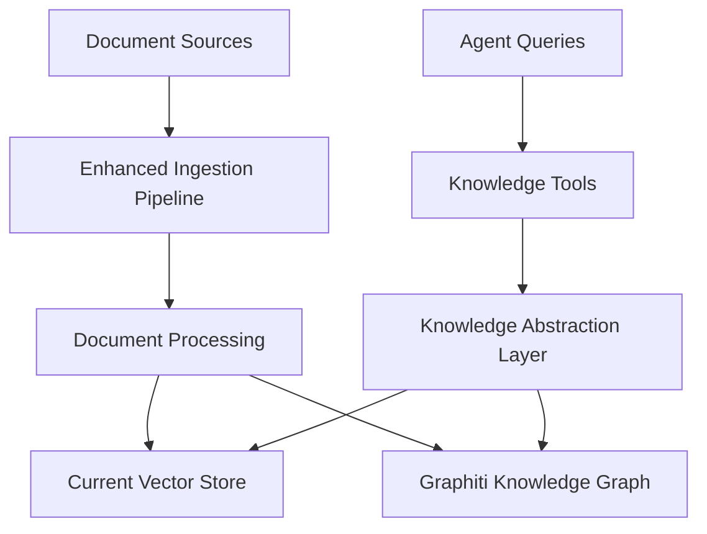

# Knowledge Pipeline Analysis Report

**Analysis Date**: [YYYY-MM-DD]  
**Analyst**: [Developer Name]  
**Agent Zero Version**: [Version/Commit Hash]  
**Analysis Duration**: [Hours spent]

---

## Executive Summary

**Recommendation**: [Proceed with Graphiti integration / Skip integration / Need more investigation]

**Key Findings**:
- [Finding 1]
- [Finding 2] 
- [Finding 3]

**Impact Assessment**: [High/Medium/Low impact if integrated]  
**Implementation Effort**: [High/Medium/Low effort required]  
**Timeline Estimate**: [X weeks/months]

---

## 1. Pre-Analysis: Existing Documentation Review

### **1.1 Existing Refactoring Documentation Check**
- [ ] Searched refactoring_plan/ for knowledge integration documentation
- [ ] **Result**: [Found existing docs / No existing docs / Partial coverage]
- [ ] **Files reviewed**: [List files checked]

**Findings**:
```markdown
[Describe what was found in existing documentation, if any]
```

**Decision**: [Proceed with analysis / Use existing plan / Update existing plan]

---

## 2. Knowledge System Component Discovery

### **2.1 Knowledge System Files Found**
```markdown
## Core Knowledge Files:
- [ ] `python/helpers/knowledge_import.py` - [Exists/Missing] - [Purpose]
- [ ] `python/helpers/rag.py` - [Exists/Missing] - [Purpose]
- [ ] `[other files]` - [Purpose]

## Knowledge Tools:
- [ ] `python/tools/[tool_name]` - [Purpose]

## Knowledge Extensions:
- [ ] `python/extensions/[extension_name]` - [Purpose]

## Knowledge Configuration:
- [ ] Location: [file:line]
- [ ] Fields: [list AgentConfig fields]
- [ ] Defaults: [list default values]
```

### **2.2 Knowledge System Architecture Map**


---

## 3. Current Knowledge Pipeline Analysis

### **3.1 Document Ingestion Analysis**

#### **Supported Document Types**:
- [ ] PDF - Loader: [class] - Capabilities: [description]
- [ ] CSV - Loader: [class] - Capabilities: [description]
- [ ] JSON - Loader: [class] - Capabilities: [description]
- [ ] HTML - Loader: [class] - Capabilities: [description]
- [ ] Markdown - Loader: [class] - Capabilities: [description]
- [ ] Text - Loader: [class] - Capabilities: [description]
- [ ] Other: [list any additional types]

#### **Processing Pipeline**:
```markdown
1. **Input Stage**: [How documents are received]
2. **Extraction Stage**: [How content is extracted]
3. **Chunking Stage**: [How documents are split]
4. **Embedding Stage**: [How embeddings are generated]
5. **Storage Stage**: [How processed data is stored]
6. **Indexing Stage**: [How search indices are built]
```

#### **Metadata Handling**:
```markdown
- **Extracted Metadata**: [List what metadata is captured]
- **Custom Metadata**: [How custom metadata is handled]
- **Metadata Schema**: [Structure of metadata]
- **Metadata Search**: [How metadata is used in search]
```

### **3.2 Knowledge Storage Analysis**

#### **Storage Architecture**:
- **Storage Type**: [Vector database/File system/Other]
- **Storage Location**: [Path/Database details]
- **Index Type**: [FAISS/Chroma/Other]
- **Persistence**: [How data is persisted]

#### **Data Schema**:
```python
# Example document structure
{
    "content": "[text content]",
    "metadata": {
        "source": "[source file]",
        "type": "[document type]",
        "timestamp": "[when ingested]",
        # [other metadata fields]
    },
    "embeddings": "[vector representation]"
}
```

### **3.3 Knowledge Retrieval Analysis**

#### **Search Capabilities**:
- [ ] **Semantic Search**: [Available/Not Available] - [Implementation]
- [ ] **Keyword Search**: [Available/Not Available] - [Implementation]
- [ ] **Hybrid Search**: [Available/Not Available] - [Implementation]
- [ ] **Metadata Filtering**: [Available/Not Available] - [Implementation]

#### **Search Interface**:
```python
# Current search API
[Include actual API signatures found]
```

#### **Result Ranking**:
- **Ranking Algorithm**: [How results are ranked]
- **Relevance Scoring**: [How relevance is calculated]
- **Result Limits**: [Default and maximum result counts]

---

## 4. Knowledge vs Memory System Analysis

### **4.1 System Relationship**:
- **Separation**: [Completely separate / Partially integrated / Fully integrated]
- **Data Flow**: [How data flows between systems]
- **Overlap**: [What content appears in both systems]
- **Use Cases**: [When each system is used]

### **4.2 Comparison Matrix**:
| Feature | Knowledge System | Memory System | Overlap |
|---------|------------------|---------------|---------|
| Data Sources | [sources] | [sources] | [overlap] |
| Storage Type | [type] | [type] | [shared?] |
| Search Method | [method] | [method] | [shared?] |
| Update Frequency | [frequency] | [frequency] | [conflicts?] |
| Use Cases | [cases] | [cases] | [overlap] |

---

## 5. Gap Analysis

### **5.1 Current Limitations**

#### **Functional Limitations**:
- [ ] **Limited Entity Extraction**: [Description of limitation]
- [ ] **No Relationship Modeling**: [Description of limitation]
- [ ] **Static Knowledge**: [Description of limitation]
- [ ] **Poor Temporal Awareness**: [Description of limitation]
- [ ] **Limited Search Capabilities**: [Description of limitation]

#### **Technical Limitations**:
- [ ] **Performance Issues**: [Description of issues]
- [ ] **Scalability Problems**: [Description of problems]
- [ ] **Integration Complexity**: [Description of complexity]
- [ ] **Maintenance Overhead**: [Description of overhead]

#### **User Experience Limitations**:
- [ ] **Complex Setup**: [Description of complexity]
- [ ] **Poor Search Results**: [Description of issues]
- [ ] **Limited Management Interface**: [Description of limitations]

### **5.2 Graphiti Integration Benefits Analysis**

| Current Limitation | Graphiti Solution | Impact Level | Implementation Effort | Priority |
|-------------------|-------------------|--------------|----------------------|----------|
| [limitation 1] | [solution] | High/Med/Low | High/Med/Low | High/Med/Low |
| [limitation 2] | [solution] | High/Med/Low | High/Med/Low | High/Med/Low |
| [limitation 3] | [solution] | High/Med/Low | High/Med/Low | High/Med/Low |

**Overall Assessment**:
- **Total Benefit Score**: [X/10]
- **Implementation Complexity**: [High/Medium/Low]
- **ROI Estimate**: [High/Medium/Low]

---

## 6. Integration Requirements

### **6.1 Functional Requirements**:
- [ ] **FR-1**: [Requirement description]
- [ ] **FR-2**: [Requirement description]
- [ ] **FR-3**: [Requirement description]

### **6.2 Technical Requirements**:
- [ ] **TR-1**: [Requirement description]
- [ ] **TR-2**: [Requirement description]
- [ ] **TR-3**: [Requirement description]

### **6.3 Performance Requirements**:
- [ ] **PR-1**: [Requirement description]
- [ ] **PR-2**: [Requirement description]
- [ ] **PR-3**: [Requirement description]

### **6.4 Compatibility Requirements**:
- [ ] **CR-1**: [Requirement description]
- [ ] **CR-2**: [Requirement description]
- [ ] **CR-3**: [Requirement description]

---

## 7. Proposed Integration Architecture

### **7.1 High-Level Architecture**:


### **7.2 Integration Strategy**:
- **Approach**: [Parallel systems / Replacement / Hybrid]
- **Migration Strategy**: [Gradual / Big bang / Phased]
- **Backward Compatibility**: [How existing APIs are preserved]

### **7.3 Data Flow Design**:
```markdown
## Enhanced Knowledge Ingestion Flow:

### Input Stage:
1. [Step description]
2. [Step description]

### Processing Stage:
1. [Step description]
2. [Step description]

### Storage Stage:
1. [Step description]
2. [Step description]

### Retrieval Stage:
1. [Step description]
2. [Step description]
```

---

## 8. Implementation Plan

### **8.1 Implementation Roadmap**:

#### **Phase 1: Foundation** ([X weeks])
- [ ] **Task 1**: [Description] - Effort: [hours] - Dependencies: [list]
- [ ] **Task 2**: [Description] - Effort: [hours] - Dependencies: [list]

#### **Phase 2: Core Integration** ([X weeks])
- [ ] **Task 1**: [Description] - Effort: [hours] - Dependencies: [list]
- [ ] **Task 2**: [Description] - Effort: [hours] - Dependencies: [list]

#### **Phase 3: Testing & Optimization** ([X weeks])
- [ ] **Task 1**: [Description] - Effort: [hours] - Dependencies: [list]
- [ ] **Task 2**: [Description] - Effort: [hours] - Dependencies: [list]

**Total Estimated Effort**: [X hours/weeks]

### **8.2 Risk Assessment**:

| Risk | Probability | Impact | Mitigation Strategy |
|------|-------------|--------|-------------------|
| [Risk 1] | High/Med/Low | High/Med/Low | [Strategy] |
| [Risk 2] | High/Med/Low | High/Med/Low | [Strategy] |
| [Risk 3] | High/Med/Low | High/Med/Low | [Strategy] |

---

## 9. Recommendations

### **9.1 Primary Recommendation**:
**[Proceed with integration / Skip integration / Need more investigation]**

**Justification**:
[Detailed explanation of recommendation based on analysis]

### **9.2 Alternative Options**:
1. **Option 1**: [Description] - Pros: [list] - Cons: [list]
2. **Option 2**: [Description] - Pros: [list] - Cons: [list]

### **9.3 Next Steps**:
1. **Immediate** (Next 1-2 weeks): [Actions]
2. **Short-term** (Next 1-2 months): [Actions]
3. **Long-term** (Next 3-6 months): [Actions]

---

## 10. Appendices

### **Appendix A: Code Analysis Details**
[Detailed code analysis, API signatures, etc.]

### **Appendix B: Performance Benchmarks**
[Any performance testing results]

### **Appendix C: Stakeholder Feedback**
[Feedback from users, developers, etc.]

---

## Analysis Validation

**Technical Validation**:
- [ ] All code references verified against actual codebase
- [ ] API signatures match current implementation
- [ ] Dependencies and imports are accurate
- [ ] Performance estimates are realistic

**Review Status**:
- [ ] Self-review completed
- [ ] Peer review completed
- [ ] Architecture review completed
- [ ] Stakeholder review completed

**Approval**:
- [ ] Technical Lead: [Name] - [Date]
- [ ] Product Owner: [Name] - [Date]
- [ ] Architecture Review: [Name] - [Date]
