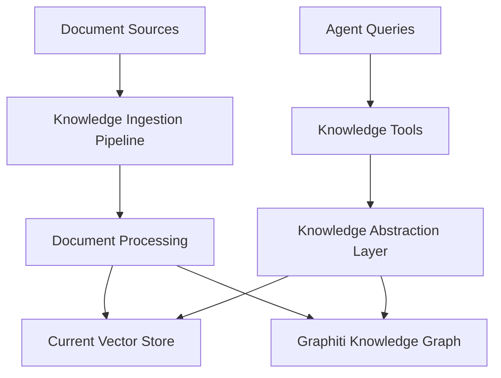

# Knowledge/Document Ingestion Pipeline Analysis Guide

**Objective**: Analyze Agent Zero's knowledge/document ingestion pipeline to determine if Graphiti integration is needed and create refactoring documentation if required.

**Target Audience**: Developers familiar with Agent Zero codebase  
**Prerequisites**: Understanding of RAG systems, vector databases, and knowledge graphs  
**Estimated Time**: 4-6 hours for complete analysis

---

## Phase 1: Pre-Analysis - Check Existing Documentation

### **Step 1.1: Review Current Refactoring Documentation**
**⚠️ CRITICAL: Check if this problem is already solved**

```bash
# Navigate to refactoring documentation
cd refactoring_plan/

# Search for knowledge/document pipeline references
grep -r -i "knowledge" *.md
grep -r -i "document.*ingest" *.md  
grep -r -i "rag" *.md
grep -r -i "pipeline" *.md
```

**Files to examine:**
- [ ] `README.md` - Check scope and objectives
- [ ] `ARCHITECTURE.md` - Look for knowledge system architecture
- [ ] `API_REFERENCE.md` - Check for knowledge-related APIs
- [ ] `IMPLEMENTATION_GUIDE.md` - Look for knowledge integration steps
- [ ] `GAP_ANALYSIS_REPORT.md` - Check for identified knowledge gaps
- [ ] `MEMORY_HISTORY_INTERACTIONS.md` - Look for knowledge vs memory distinctions

**Decision Point:**
- ✅ **If knowledge pipeline integration is already documented**: Review existing plan and validate against current codebase
- ❌ **If not documented**: Proceed with full analysis

### **Step 1.2: Understand Current Memory vs Knowledge Distinction**
**Goal**: Clarify the difference between memory and knowledge systems

**Key Questions:**
1. How does Agent Zero distinguish between memory and knowledge?
2. Are they separate systems or integrated?
3. What types of data go to each system?

---

## Phase 2: Codebase Discovery and Mapping

### **Step 2.1: Identify Knowledge System Components**
**Goal**: Map all knowledge-related code in the codebase

```bash
# Find knowledge-related files
find . -name "*knowledge*" -type f
find . -name "*rag*" -type f  
find . -name "*ingest*" -type f
find . -name "*document*" -type f

# Search for knowledge references in code
grep -r "knowledge" --include="*.py" python/
grep -r "Knowledge" --include="*.py" python/
grep -r "RAG" --include="*.py" python/
grep -r "document.*load" --include="*.py" python/
```

**Create Discovery Map:**
```markdown
## Knowledge System Components Found:
- [ ] File: `path/to/file.py` - Purpose: [description]
- [ ] File: `path/to/file.py` - Purpose: [description]
- [ ] Directory: `path/to/dir/` - Contains: [description]
```

### **Step 2.2: Analyze Knowledge Configuration**
**Goal**: Understand how knowledge is configured

**Files to examine:**
```bash
# Check configuration files
cat agent.py | grep -A 10 -B 10 "knowledge"
cat initialize.py | grep -A 10 -B 10 "knowledge"
grep -r "knowledge_subdirs" --include="*.py" .
```

**Document findings:**
```markdown
## Knowledge Configuration:
- Configuration location: [file:line]
- Configuration structure: [AgentConfig fields]
- Default values: [list defaults]
- Environment variables: [if any]
```

### **Step 2.3: Map Knowledge Tools and Extensions**
**Goal**: Find all knowledge-related tools and extensions

```bash
# Find knowledge tools
find python/tools/ -name "*knowledge*" -o -name "*document*" -o -name "*rag*"

# Find knowledge extensions  
find python/extensions/ -name "*knowledge*" -o -name "*document*" -o -name "*rag*"

# Search for knowledge tool usage in prompts
grep -r "knowledge" prompts/
```

**Document findings:**
```markdown
## Knowledge Tools Found:
- [ ] Tool: `tool_name` - File: `path` - Purpose: [description]

## Knowledge Extensions Found:  
- [ ] Extension: `extension_name` - File: `path` - Purpose: [description]

## Knowledge Prompts Found:
- [ ] Prompt: `prompt_name` - File: `path` - Purpose: [description]
```

---

## Phase 3: Deep Dive Analysis

### **Step 3.1: Analyze Knowledge Import Pipeline**
**Goal**: Understand how documents are ingested and processed

**Key file to analyze**: `python/helpers/knowledge_import.py`

```python
# Analysis checklist for knowledge_import.py:
```

**Analysis Questions:**
1. **Document Types**: What file formats are supported?
2. **Processing Pipeline**: How are documents processed?
3. **Storage Mechanism**: Where/how are processed documents stored?
4. **Metadata Handling**: What metadata is extracted and preserved?
5. **Chunking Strategy**: How are large documents split?
6. **Embedding Generation**: How are embeddings created?
7. **Index Management**: How is the search index maintained?

**Document findings:**
```markdown
## Knowledge Import Pipeline Analysis:

### Supported Document Types:
- [ ] PDF - Loader: [class] - Processing: [description]
- [ ] CSV - Loader: [class] - Processing: [description]  
- [ ] JSON - Loader: [class] - Processing: [description]
- [ ] HTML - Loader: [class] - Processing: [description]
- [ ] Markdown - Loader: [class] - Processing: [description]
- [ ] Text - Loader: [class] - Processing: [description]

### Processing Pipeline:
1. Step 1: [description]
2. Step 2: [description]
3. Step 3: [description]

### Storage Architecture:
- Storage location: [path/database]
- Index type: [FAISS/other]
- Metadata schema: [structure]

### Current Limitations:
- [ ] Limitation 1: [description]
- [ ] Limitation 2: [description]
```

### **Step 3.2: Analyze Knowledge Retrieval System**
**Goal**: Understand how knowledge is searched and retrieved

**Files to analyze:**
- Knowledge tools (if found in Step 2.3)
- RAG-related helpers
- Search/retrieval mechanisms

**Analysis Questions:**
1. **Search Interface**: How do users/agents search knowledge?
2. **Retrieval Strategy**: Semantic search, keyword search, hybrid?
3. **Ranking Algorithm**: How are results ranked?
4. **Context Integration**: How is retrieved knowledge integrated into responses?
5. **Performance**: Any performance bottlenecks or limitations?

### **Step 3.3: Analyze Knowledge vs Memory Integration**
**Goal**: Understand the relationship between knowledge and memory systems

**Key Analysis Points:**
```python
# Compare memory.py and knowledge systems:
```

**Questions to answer:**
1. **Data Flow**: Does knowledge feed into memory or vice versa?
2. **Search Integration**: Can searches span both knowledge and memory?
3. **Duplication**: Is there overlap between knowledge and memory content?
4. **Use Cases**: When is knowledge used vs memory?
5. **Performance**: Are there performance differences?

---

## Phase 4: Gap Analysis and Requirements

### **Step 4.1: Identify Current Limitations**
**Goal**: Document limitations of the current knowledge system

**Analysis Framework:**
```markdown
## Current Knowledge System Limitations:

### Functional Limitations:
- [ ] Limited document types
- [ ] Poor metadata extraction
- [ ] No relationship modeling
- [ ] Static knowledge (no updates)
- [ ] No temporal awareness
- [ ] Limited search capabilities

### Technical Limitations:
- [ ] Performance bottlenecks
- [ ] Scalability issues  
- [ ] Memory usage problems
- [ ] Integration complexity
- [ ] Maintenance overhead

### User Experience Limitations:
- [ ] Complex setup process
- [ ] Limited search interface
- [ ] Poor result relevance
- [ ] No knowledge management UI
```

### **Step 4.2: Evaluate Graphiti Integration Benefits**
**Goal**: Determine if Graphiti would address current limitations

**Evaluation Matrix:**
```markdown
## Graphiti Integration Benefits Analysis:

| Current Limitation | Graphiti Solution | Impact Level | Implementation Effort |
|-------------------|-------------------|--------------|----------------------|
| No relationship modeling | Entity/relationship extraction | High | Medium |
| Static knowledge | Temporal knowledge graph | High | Medium |
| Poor search relevance | Graph-based semantic search | Medium | Low |
| Limited metadata | Rich entity metadata | Medium | Low |
| No knowledge evolution | Temporal fact tracking | High | High |

## Overall Assessment:
- **Total Benefits**: [High/Medium/Low]
- **Implementation Complexity**: [High/Medium/Low]  
- **ROI Estimate**: [High/Medium/Low]
```

### **Step 4.3: Define Integration Requirements**
**Goal**: Specify what needs to be integrated if proceeding

**Requirements Categories:**
```markdown
## Integration Requirements:

### Functional Requirements:
- [ ] Requirement 1: [description]
- [ ] Requirement 2: [description]

### Technical Requirements:
- [ ] Requirement 1: [description]
- [ ] Requirement 2: [description]

### Performance Requirements:
- [ ] Requirement 1: [description]
- [ ] Requirement 2: [description]

### Compatibility Requirements:
- [ ] Requirement 1: [description]
- [ ] Requirement 2: [description]
```

---

## Phase 5: Architecture Design

### **Step 5.1: Design Integration Architecture**
**Goal**: Create high-level architecture for Graphiti integration

**Architecture Considerations:**
1. **Parallel vs Replacement**: Should Graphiti run alongside existing system or replace it?
2. **Data Flow**: How should data flow between knowledge ingestion and Graphiti?
3. **API Compatibility**: How to maintain existing knowledge tool APIs?
4. **Performance**: How to ensure good performance with dual systems?

**Create Architecture Diagram:**


### **Step 5.2: Design Data Flow**
**Goal**: Specify how data flows through the integrated system

**Data Flow Specification:**
```markdown
## Knowledge Ingestion Data Flow:

### Input Stage:
1. Document uploaded/imported
2. Document type detection
3. Content extraction

### Processing Stage:
1. Text chunking/segmentation
2. Metadata extraction
3. Entity recognition (new with Graphiti)
4. Relationship extraction (new with Graphiti)

### Storage Stage:
1. Vector embedding generation
2. Vector store update (existing)
3. Knowledge graph update (new with Graphiti)
4. Cross-reference creation

### Retrieval Stage:
1. Query processing
2. Vector search (existing)
3. Graph search (new with Graphiti)
4. Result fusion and ranking
5. Response generation
```

---

## Phase 6: Implementation Planning

### **Step 6.1: Create Implementation Roadmap**
**Goal**: Break down implementation into manageable phases

**Roadmap Template:**
```markdown
## Implementation Roadmap:

### Phase 1: Foundation (Week 1-2)
- [ ] Task 1: [description] - Effort: [hours] - Dependencies: [list]
- [ ] Task 2: [description] - Effort: [hours] - Dependencies: [list]

### Phase 2: Core Integration (Week 3-4)  
- [ ] Task 1: [description] - Effort: [hours] - Dependencies: [list]
- [ ] Task 2: [description] - Effort: [hours] - Dependencies: [list]

### Phase 3: Testing & Optimization (Week 5-6)
- [ ] Task 1: [description] - Effort: [hours] - Dependencies: [list]
- [ ] Task 2: [description] - Effort: [hours] - Dependencies: [list]

### Total Estimated Effort: [X hours/weeks]
```

### **Step 6.2: Identify Risks and Mitigation**
**Goal**: Plan for potential implementation challenges

**Risk Assessment:**
```markdown
## Implementation Risks:

| Risk | Probability | Impact | Mitigation Strategy |
|------|-------------|--------|-------------------|
| Performance degradation | Medium | High | Implement caching, optimize queries |
| API compatibility issues | Low | High | Maintain abstraction layer |
| Data migration complexity | High | Medium | Phased migration approach |
| Integration complexity | Medium | Medium | Prototype first, iterate |
```

---

## Phase 7: Documentation Creation

### **Step 7.1: Create Refactoring Documentation**
**Goal**: Document the complete refactoring plan

**Required Documents:**
- [ ] `KNOWLEDGE_GRAPHITI_INTEGRATION.md` - Main integration plan
- [ ] `KNOWLEDGE_ARCHITECTURE.md` - Updated architecture
- [ ] `KNOWLEDGE_API_REFERENCE.md` - API changes and additions
- [ ] `KNOWLEDGE_MIGRATION_GUIDE.md` - Migration procedures
- [ ] `KNOWLEDGE_TESTING_STRATEGY.md` - Testing approach

### **Step 7.2: Update Existing Documentation**
**Goal**: Ensure consistency with existing refactoring docs

**Updates Required:**
- [ ] Update `ARCHITECTURE.md` with knowledge system changes
- [ ] Update `API_REFERENCE.md` with new knowledge APIs
- [ ] Update `IMPLEMENTATION_GUIDE.md` with knowledge integration steps
- [ ] Update `README.md` with knowledge system overview

---

## Phase 8: Validation and Review

### **Step 8.1: Technical Validation**
**Goal**: Validate the analysis and design against actual codebase

**Validation Checklist:**
- [ ] All code references verified against actual files
- [ ] API signatures match current implementation
- [ ] Dependencies and imports are accurate
- [ ] Performance estimates are realistic
- [ ] Integration points are feasible

### **Step 8.2: Stakeholder Review**
**Goal**: Get feedback on the analysis and proposed integration

**Review Process:**
1. **Technical Review**: Code accuracy and feasibility
2. **Architecture Review**: Design soundness and scalability  
3. **Business Review**: Value proposition and ROI
4. **User Experience Review**: Impact on developer/user experience

---

## Deliverables Checklist

### **Analysis Deliverables:**
- [ ] Knowledge system component map
- [ ] Current pipeline analysis document
- [ ] Gap analysis report
- [ ] Integration requirements specification

### **Design Deliverables:**
- [ ] Integration architecture diagram
- [ ] Data flow specification
- [ ] API design document
- [ ] Performance analysis

### **Planning Deliverables:**
- [ ] Implementation roadmap
- [ ] Risk assessment and mitigation plan
- [ ] Testing strategy
- [ ] Migration plan

### **Documentation Deliverables:**
- [ ] Complete refactoring documentation set
- [ ] Updated existing documentation
- [ ] Developer implementation guide
- [ ] User migration guide

---

## Success Criteria

**Analysis is complete when:**
✅ All knowledge system components are mapped and understood  
✅ Current limitations are clearly identified and documented  
✅ Graphiti integration benefits are quantified  
✅ Implementation plan is detailed and realistic  
✅ All documentation is created and validated  
✅ Technical feasibility is confirmed  
✅ Stakeholder approval is obtained  

**Next Steps:**
- If integration is approved: Begin implementation following the roadmap
- If integration is not needed: Document decision rationale and archive analysis
- If more analysis is needed: Identify specific areas requiring deeper investigation
