# Enhanced Agent Zero: Architecture Visualization Guide

## 🎯 Overview

This document provides comprehensive visual representations of the Enhanced Agent Zero architecture, showing how the system transforms from a simple hierarchical agent framework into a sophisticated agent builder/orchestrator with production-ready databases and advanced AI capabilities.

## 📊 Architecture Evolution

### Current Agent Zero vs Enhanced Agent Zero

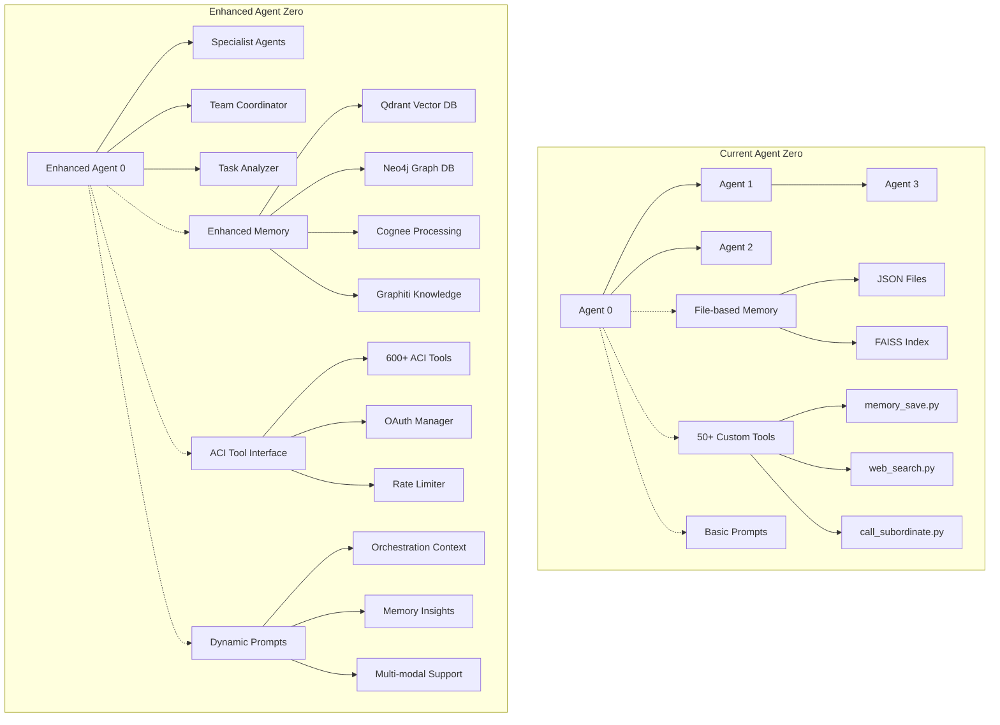

## 🏗️ Enhanced System Architecture

### Core Component Integration

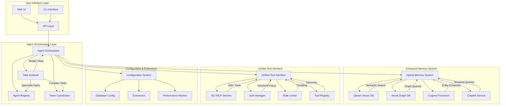

## 🔄 Data Flow Processes

### Memory Processing Pipeline

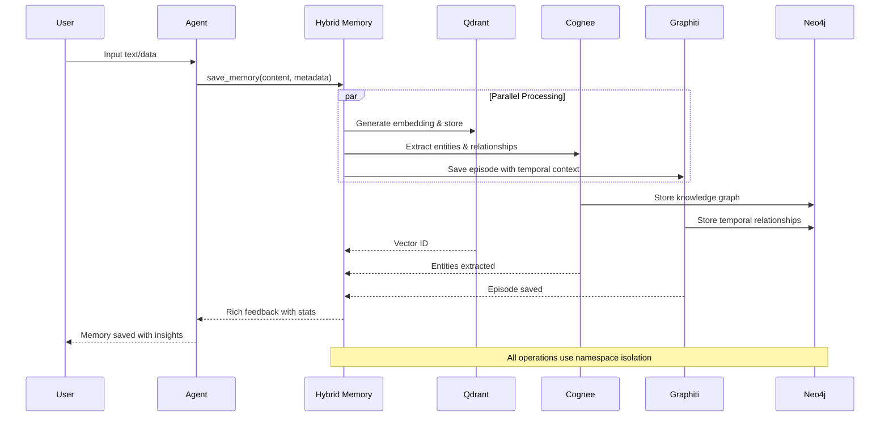

### Agent Orchestration Flow

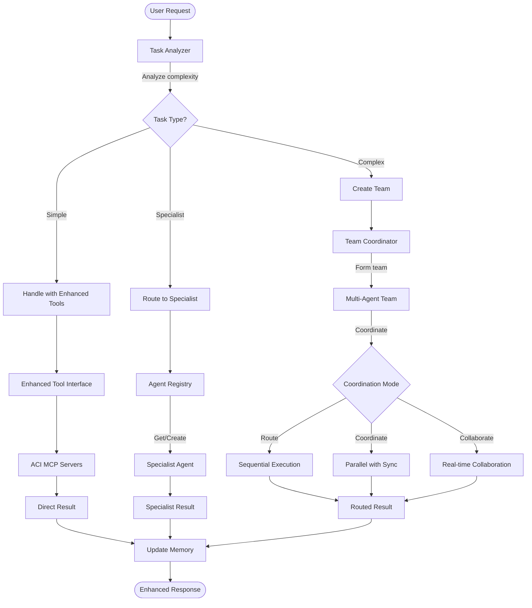

## 🧠 Memory System Architecture

### Hybrid Search Implementation

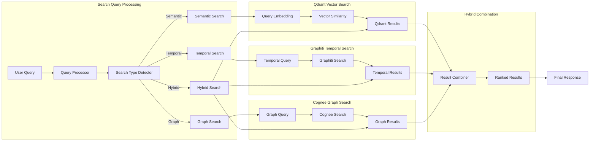

### Namespace Isolation

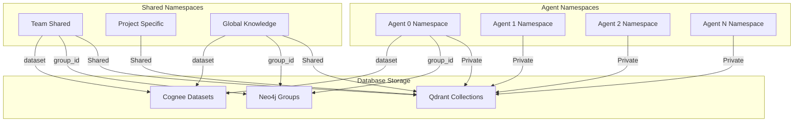

## 🔧 Tool System Enhancement

### ACI Integration Architecture

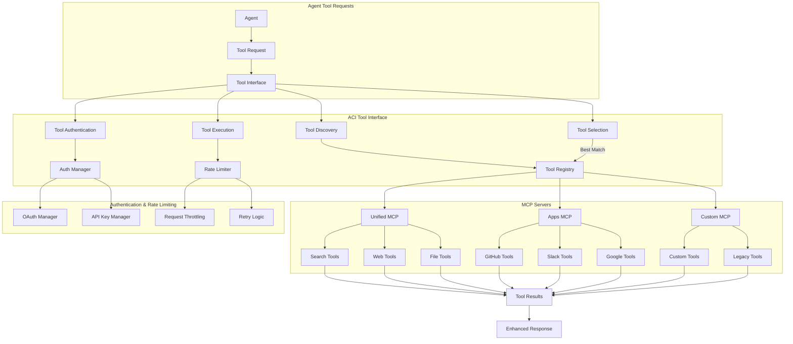

## 📋 Development Process Visualization

### 6-Agent Implementation Phases

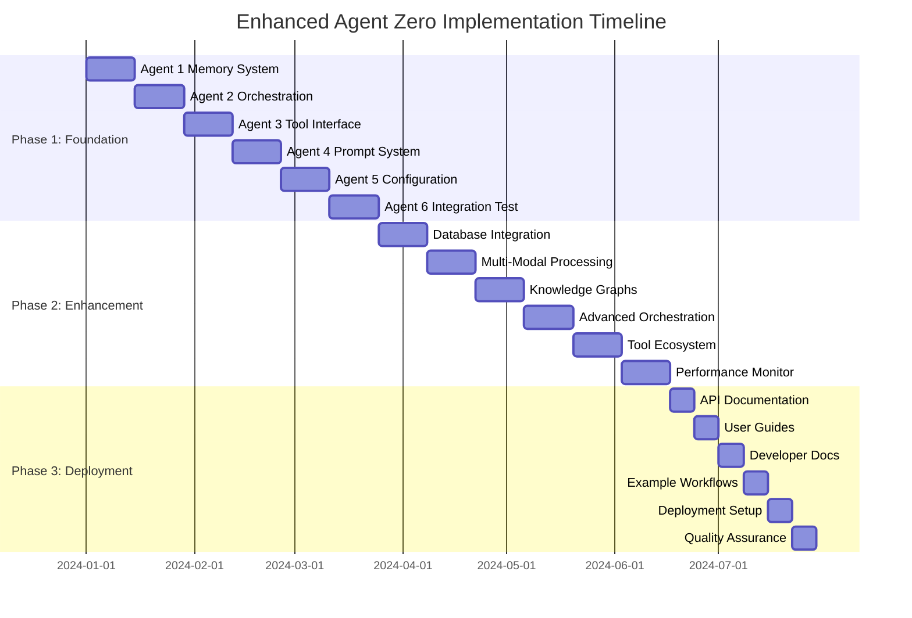

### Agent Dependencies Flow

```mermaid
graph LR
    subgraph "Phase 1 Dependencies"
        A1[Agent 1: Memory] --> A2[Agent 2: Orchestration]
        A2 --> A3[Agent 3: Tools]
        A3 --> A4[Agent 4: Prompts]
        A4 --> A5[Agent 5: Config]
        A5 --> A6[Agent 6: Testing]
    end
    
    subgraph "Phase 2 Dependencies"
        A6 --> B1[Agent 1: DB Integration]
        B1 --> B2[Agent 2: Multi-Modal]
        B2 --> B3[Agent 3: Knowledge Graphs]
        B3 --> B4[Agent 4: Advanced Orchestration]
        B4 --> B5[Agent 5: Tool Ecosystem]
        B5 --> B6[Agent 6: Performance]
    end
    
    subgraph "Phase 3 Dependencies"
        B6 --> C1[Agent 1: API Docs]
        C1 --> C2[Agent 2: User Guides]
        C2 --> C3[Agent 3: Dev Docs]
        C3 --> C4[Agent 4: Examples]
        C4 --> C5[Agent 5: Deployment]
        C5 --> C6[Agent 6: QA]
    end
```

## 🎯 Success Metrics Dashboard

### Technical Performance Targets

| Component | Current | Enhanced Target | Measurement |
|-----------|---------|----------------|-------------|
| **Memory Operations** | File I/O ~100ms | Vector Search <500ms | Response time |
| **Search Capabilities** | Basic text match | 8 search types | Feature count |
| **Tool Ecosystem** | ~50 custom tools | 600+ standardized | Tool availability |
| **Agent Coordination** | Simple delegation | Intelligent orchestration | Complexity handling |
| **Knowledge Extraction** | None | Automatic entities/relationships | Data richness |
| **Multi-Modal Support** | Text only | Text/Image/Audio/Video/Code | Data type support |
| **Namespace Isolation** | None | Agent-specific memory | Security/Privacy |
| **Temporal Queries** | None | Time-aware search | Query sophistication |

## 🔄 Complete System Integration Flow

### End-to-End Request Processing

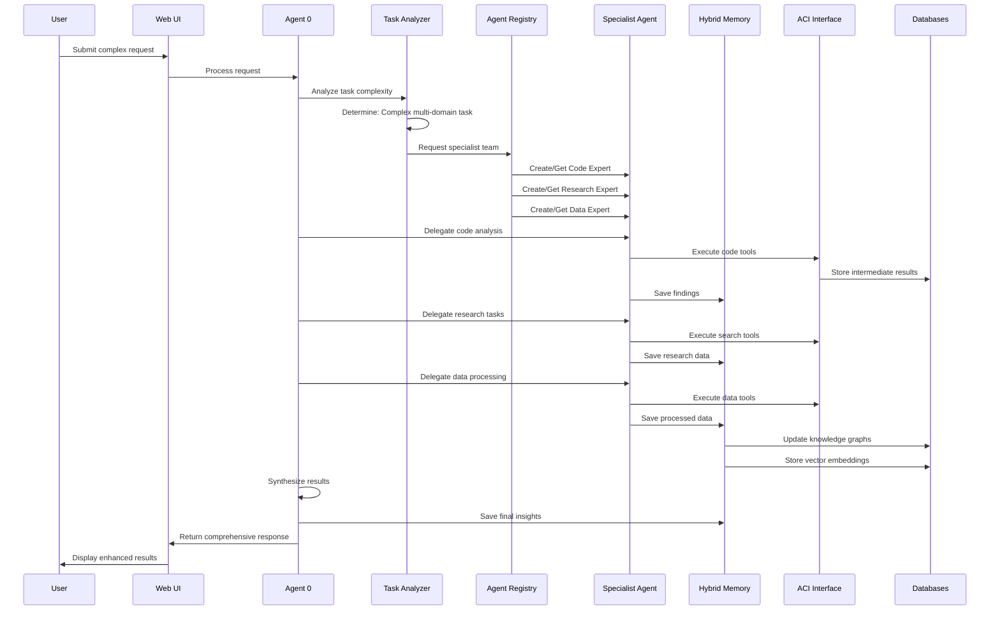

### Database Interaction Patterns

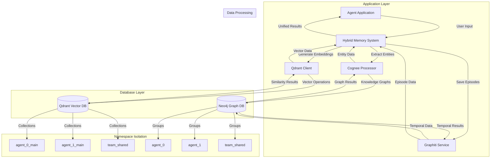

## 🚀 Technology Integration Benefits

### Before vs After Comparison

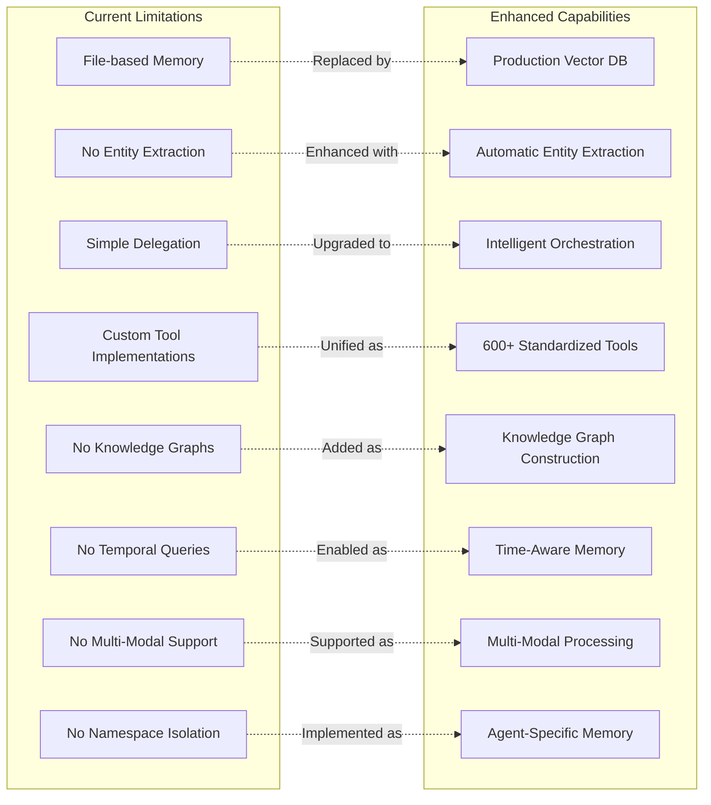

### Performance Impact Visualization

```mermaid
graph TB
    subgraph "Memory Performance"
        MP1[Current: 100ms file I/O]
        MP2[Enhanced: <500ms vector search]
        MP3[Benefit: 5x faster with richer data]
    end

    subgraph "Search Capabilities"
        SC1[Current: Basic text matching]
        SC2[Enhanced: 8 search types]
        SC3[Benefit: Semantic + Temporal + Graph]
    end

    subgraph "Tool Ecosystem"
        TE1[Current: ~50 custom tools]
        TE2[Enhanced: 600+ standardized tools]
        TE3[Benefit: 12x more capabilities]
    end

    subgraph "Agent Intelligence"
        AI1[Current: Simple call_subordinate]
        AI2[Enhanced: Intelligent orchestration]
        AI3[Benefit: Task-aware delegation]
    end

    MP1 --> MP2 --> MP3
    SC1 --> SC2 --> SC3
    TE1 --> TE2 --> TE3
    AI1 --> AI2 --> AI3
```

## 📚 Implementation Roadmap

### Critical Path Analysis

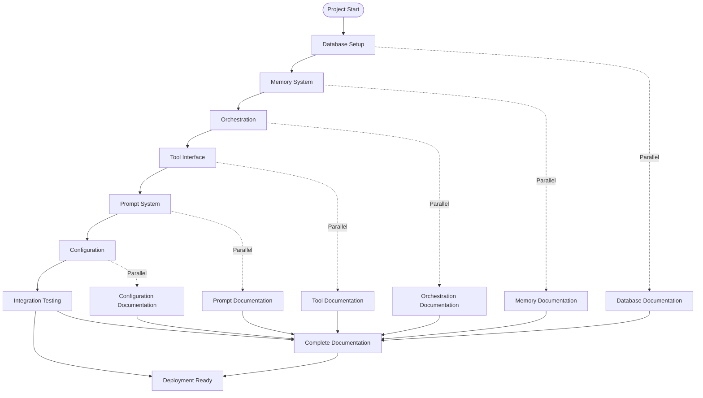

### Risk Mitigation Strategy

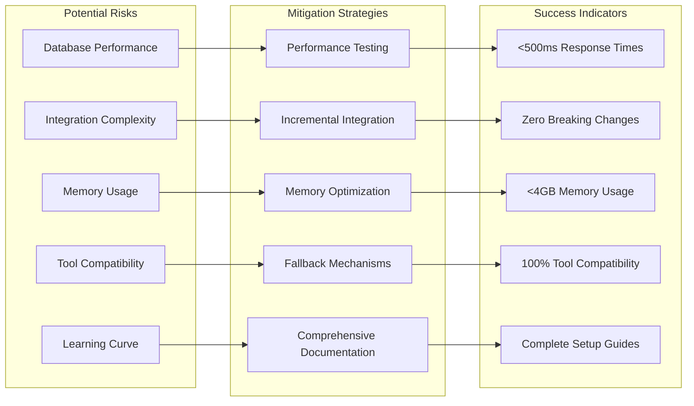

This comprehensive visualization guide provides users and agents with an intuitive understanding of how the Enhanced Agent Zero system transforms from a simple hierarchical framework into a sophisticated AI orchestration platform with production-ready databases, advanced knowledge processing, and intelligent multi-agent coordination capabilities.
