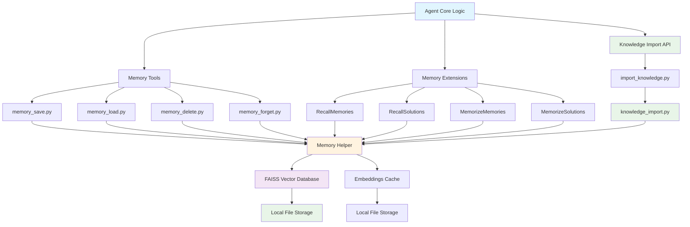
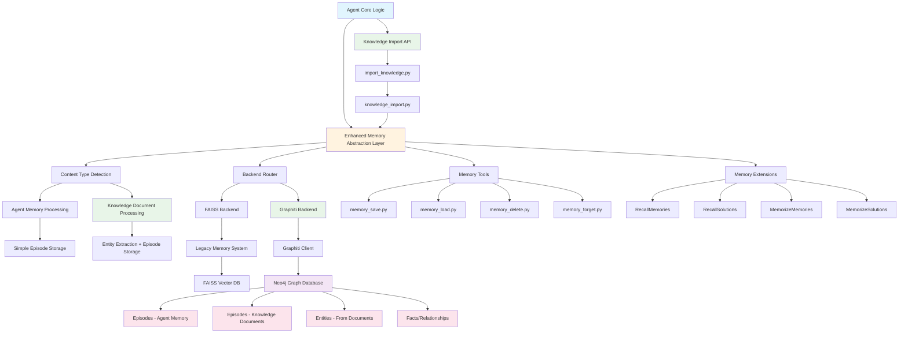

# Unified Memory & Knowledge System Architecture

## Overview

This document describes the architecture of agent-zero's unified memory and knowledge system before and after the Graphiti temporal knowledge graph integration. The enhanced system handles both agent conversations (memory) and external documents (knowledge) through a single abstraction layer with content-type specific processing.

## Before: FAISS-Based Memory & Knowledge System

### Architecture Diagram



### Components

**Memory Helper (`python/helpers/memory.py`)**
- Singleton factory pattern with static index
- FAISS vector database management
- Document storage with metadata
- Similarity search with threshold filtering
- Memory areas: MAIN, FRAGMENTS, SOLUTIONS, INSTRUMENTS
- Knowledge preloading from knowledge directories

**Knowledge Import System**
- **API Layer** (`python/api/import_knowledge.py`): File upload endpoint
- **Processing Layer** (`python/helpers/knowledge_import.py`): Document parsing and chunking
- **Supported Formats**: TXT, PDF, CSV, HTML, JSON, MD
- **Integration**: Knowledge flows into same FAISS database as memory

**Memory Tools**
- Direct interface for agent memory operations
- Simple CRUD operations on memory documents
- Metadata-based filtering and search

**Memory Extensions**
- Automated memory management
- Background recall and memorization
- Integration with agent's thought loop

### Data Flow

1. **Memory Save**: Text → Embeddings → FAISS Index → Local Storage
2. **Knowledge Import**: Documents → LangChain Loaders → Text Chunks → FAISS Index (same as memory)
3. **Memory Load**: Query → Embeddings → FAISS Search → Filtered Results (memory + knowledge)
4. **Memory Delete**: IDs → FAISS Delete → Index Update
5. **Auto Recall**: History → Query Generation → Unified Search → Prompt Injection

## After: Unified Graphiti Temporal Knowledge Graph

### Architecture Diagram



### New Components

**Enhanced Memory Abstraction Layer**
- Unified interface for all memory and knowledge operations
- Content-type detection (agent_memory vs knowledge_document)
- Backend switching based on configuration
- Graceful fallback and error handling
- API compatibility with existing tools

**Content Processing Pipeline**
- **Agent Memory**: Simple episode storage for conversations
- **Knowledge Documents**: Entity extraction + enhanced episode storage
- **Unified Search**: Cross-domain search across memory and knowledge
- **Metadata Preservation**: Maintains existing area-based organization

**Graphiti Backend**
- Temporal knowledge graph implementation
- Episode-based information storage
- Entity and relationship extraction for knowledge documents
- Graph-based semantic search with temporal context
- Unified storage for both memory and knowledge

**Neo4j Integration**
- Graph database for complex relationships
- Temporal data with reference times
- Advanced querying capabilities
- Scalable and performant storage

### Enhanced Data Flow

1. **Agent Memory Save**: Text → Simple Episode Creation → Graph Storage
2. **Knowledge Document Import**: Document → LangChain Processing → Entity Extraction → Enhanced Episode Creation → Graph Storage
3. **Unified Search**: Query → Graph Search → Relationship Traversal → Cross-Domain Results
4. **Temporal Queries**: Time-based filtering and relationship evolution
5. **Context-Aware Recall**: Center node search for personalized results across memory and knowledge

## Key Improvements

### 1. Temporal Capabilities
- All memories have reference times
- Track information evolution over time
- Query historical states and changes
- Understand temporal relationships

### 2. Relationship Modeling
- Entities and their connections
- Fact-based relationship storage
- Graph traversal for context discovery
- Semantic relationship understanding

### 3. Enhanced Search
- Graph-based semantic search
- Center node personalization
- Relationship-aware ranking
- Multi-hop reasoning capabilities

### 4. Scalability
- Neo4j's proven scalability
- Efficient graph algorithms
- Optimized for relationship queries
- Better performance with large datasets

## Implementation Strategy

### Abstraction Layer Benefits
- **Zero Breaking Changes**: Existing APIs remain unchanged
- **Clean Implementation**: Fresh start without legacy concerns
- **Backend Flexibility**: Easy switching between implementations
- **Future Extensibility**: Ready for additional backend types

### Data Format Design
```
Memory Document (Unified Format)
{
  "id": "episode-uuid-123",
  "page_content": "User prefers Python for data analysis",
  "metadata": {
    "area": "main",
    "timestamp": "2024-01-01T10:00:00Z",
    "source_description": "agent-zero-main",
    "category": "preference"
  },
  "score": 0.85  // For search results
}

Graphiti Episode (Backend Format)
{
  "name": "Memory: Main",
  "episode_body": "User prefers Python for data analysis",
  "source": "message",
  "reference_time": "2024-01-01T10:00:00Z",
  "source_description": "agent-zero-main"
}
```

## Configuration Management

### Environment Variables
```bash
# Backend Selection
MEMORY_BACKEND=graphiti|faiss

# Graphiti Configuration (when MEMORY_BACKEND=graphiti)
NEO4J_URI=bolt://localhost:7687
NEO4J_USER=neo4j
NEO4J_PASSWORD=password
GRAPHITI_GROUP_ID=agent-zero-default

# Required for Graphiti
OPENAI_API_KEY=your_openai_api_key
```

### Agent Configuration
```python
@dataclass
class AgentConfig:
    # ... existing config fields ...

    # Graphiti settings (use memory_backend to enable)
    memory_backend: str = "faiss"  # "faiss" or "graphiti"

    # Additional configuration can be stored in:
    additional: Dict[str, Any] = field(default_factory=dict)

    # Example usage:
    # config.additional["graphiti_config"] = {
    #     "uri": "bolt://localhost:7687",
    #     "user": "neo4j",
    #     "password": "password",
    #     "group_id": "default"
    # }
```

## Performance Considerations

### FAISS vs Graphiti
| Aspect | FAISS | Graphiti |
|--------|-------|----------|
| Search Speed | Very Fast | Fast |
| Relationship Queries | Limited | Excellent |
| Temporal Queries | None | Native |
| Scalability | Good | Excellent |
| Memory Usage | Low | Moderate |
| Setup Complexity | Simple | Moderate |

### Optimization Strategies
- **Indexing**: Proper Neo4j indices for performance
- **Caching**: Cache frequently accessed nodes/relationships
- **Batch Operations**: Bulk inserts for better performance
- **Query Optimization**: Efficient Cypher queries

## Security Considerations

### Data Protection
- Neo4j authentication and authorization
- Encrypted connections (TLS)
- Secure credential management
- Network isolation for database

### Access Control
- User-based data isolation via group_id
- Role-based access to memory operations
- Audit logging for sensitive operations

## Monitoring and Observability

### Key Metrics
- Memory operation latency
- Neo4j database performance
- Error rates and types
- Memory usage patterns
- Query complexity and performance

### Logging
- Structured logging for all memory operations
- Performance metrics collection
- Error tracking and alerting
- Migration progress monitoring

## Future Enhancements

### Planned Features
- **Multi-modal Memory**: Support for images, audio, video
- **Advanced Reasoning**: Graph neural networks for inference
- **Collaborative Memory**: Shared knowledge across agent instances
- **Memory Compression**: Intelligent summarization of old memories
- **Real-time Updates**: Live memory updates during conversations

### Integration Opportunities
- **Knowledge Graphs**: Integration with external knowledge bases
- **Semantic Web**: RDF/OWL compatibility
- **Machine Learning**: Graph-based ML for memory insights
- **Analytics**: Memory usage analytics and optimization
